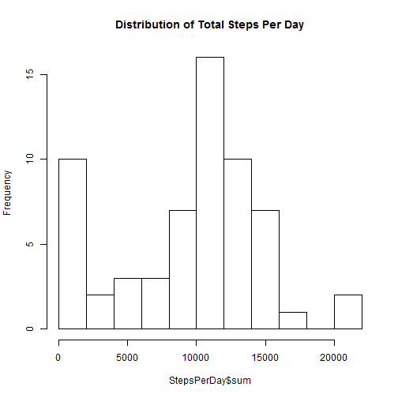

# Part A: Loading and Processing the data

## A1: Code needed to load the data


```r
#Loading and preprocessing the data
act<-read.csv("C:/Users/Dan_Wolf/Documents/DataScience/JHU5_RR/activity.csv",na.strings="NA")
head(act)
```

```
##   steps       date interval
## 1    NA 2012-10-01        0
## 2    NA 2012-10-01        5
## 3    NA 2012-10-01       10
## 4    NA 2012-10-01       15
## 5    NA 2012-10-01       20
## 6    NA 2012-10-01       25
```

```r
summary(act)
```

```
##      steps                date          interval     
##  Min.   :  0.00   2012-10-01:  288   Min.   :   0.0  
##  1st Qu.:  0.00   2012-10-02:  288   1st Qu.: 588.8  
##  Median :  0.00   2012-10-03:  288   Median :1177.5  
##  Mean   : 37.38   2012-10-04:  288   Mean   :1177.5  
##  3rd Qu.: 12.00   2012-10-05:  288   3rd Qu.:1766.2  
##  Max.   :806.00   2012-10-06:  288   Max.   :2355.0  
##  NA's   :2304     (Other)   :15840
```

## A2: Preprocess the data 
Make interval a factor

```r
#make interval a factor
act$interval <- factor(act$interval)
#install.packages("timeDate")
library(timeDate)
#Create a column that indicates of a day is a weekday or weekend
act$dayType<-ifelse(isWeekday(act$date, wday=1:5),"Weekday","Weekend")
# check 
table(act$dayType)
```

```
## 
## Weekday Weekend 
##   12960    4608
```


# Part B: What is mean total number of steps taken per day?

## B1: Calculate Total number of steps taken per day 


```r
#install.packages("plyr")
library(plyr)
ddply(act,.(date),summarize, "mean"=mean(steps,na.rm=TRUE), "median" = median(steps,na.rm=TRUE),"sum"=sum(steps,na.rm=TRUE))
```

## B2: Histogram of total steps taken each day


```r
StepsPerDay<-ddply(act,.(date),summarize,"sum"=sum(steps,na.rm=TRUE), "mean"=mean(steps,na.rm=TRUE), "median" = median(steps,na.rm=TRUE))
#install.packages("ggplot2")
library(ggplot2)
hist(StepsPerDay$sum,breaks=10,main="Distribution of Total Steps Per Day")
```

 

## B3: Mean, median and total number (Sum) of steps taken each day

```r
print (StepsPerDay)
```

```
##          date   sum       mean median
## 1  2012-10-01     0        NaN     NA
## 2  2012-10-02   126  0.4375000      0
## 3  2012-10-03 11352 39.4166667      0
## 4  2012-10-04 12116 42.0694444      0
## 5  2012-10-05 13294 46.1597222      0
## 6  2012-10-06 15420 53.5416667      0
## 7  2012-10-07 11015 38.2465278      0
## 8  2012-10-08     0        NaN     NA
## 9  2012-10-09 12811 44.4826389      0
## 10 2012-10-10  9900 34.3750000      0
## 11 2012-10-11 10304 35.7777778      0
## 12 2012-10-12 17382 60.3541667      0
## 13 2012-10-13 12426 43.1458333      0
## 14 2012-10-14 15098 52.4236111      0
## 15 2012-10-15 10139 35.2048611      0
## 16 2012-10-16 15084 52.3750000      0
## 17 2012-10-17 13452 46.7083333      0
## 18 2012-10-18 10056 34.9166667      0
## 19 2012-10-19 11829 41.0729167      0
## 20 2012-10-20 10395 36.0937500      0
## 21 2012-10-21  8821 30.6284722      0
## 22 2012-10-22 13460 46.7361111      0
## 23 2012-10-23  8918 30.9652778      0
## 24 2012-10-24  8355 29.0104167      0
## 25 2012-10-25  2492  8.6527778      0
## 26 2012-10-26  6778 23.5347222      0
## 27 2012-10-27 10119 35.1354167      0
## 28 2012-10-28 11458 39.7847222      0
## 29 2012-10-29  5018 17.4236111      0
## 30 2012-10-30  9819 34.0937500      0
## 31 2012-10-31 15414 53.5208333      0
## 32 2012-11-01     0        NaN     NA
## 33 2012-11-02 10600 36.8055556      0
## 34 2012-11-03 10571 36.7048611      0
## 35 2012-11-04     0        NaN     NA
## 36 2012-11-05 10439 36.2465278      0
## 37 2012-11-06  8334 28.9375000      0
## 38 2012-11-07 12883 44.7326389      0
## 39 2012-11-08  3219 11.1770833      0
## 40 2012-11-09     0        NaN     NA
## 41 2012-11-10     0        NaN     NA
## 42 2012-11-11 12608 43.7777778      0
## 43 2012-11-12 10765 37.3784722      0
## 44 2012-11-13  7336 25.4722222      0
## 45 2012-11-14     0        NaN     NA
## 46 2012-11-15    41  0.1423611      0
## 47 2012-11-16  5441 18.8923611      0
## 48 2012-11-17 14339 49.7881944      0
## 49 2012-11-18 15110 52.4652778      0
## 50 2012-11-19  8841 30.6979167      0
## 51 2012-11-20  4472 15.5277778      0
## 52 2012-11-21 12787 44.3993056      0
## 53 2012-11-22 20427 70.9270833      0
## 54 2012-11-23 21194 73.5902778      0
## 55 2012-11-24 14478 50.2708333      0
## 56 2012-11-25 11834 41.0902778      0
## 57 2012-11-26 11162 38.7569444      0
## 58 2012-11-27 13646 47.3819444      0
## 59 2012-11-28 10183 35.3576389      0
## 60 2012-11-29  7047 24.4687500      0
## 61 2012-11-30     0        NaN     NA
```


# Part C: What is average daily activity pattern? 

## C1: Plot 5 min interval vs average number of steps taken averaged across all days


```r
meanStepsPerInterval<-ddply(act,.(interval),summarize,"mean"=mean(steps,na.rm=TRUE))
plot(x<-as.numeric(paste(meanStepsPerInterval$interval)),y<-meanStepsPerInterval$mean,type="l",xlab="Interval Start Time",ylab="Average Total Steps per 5min Interval", main="Average Total Steps Per 5 Min Interval")
```

 


## C2: Which 5 min interval across all days in the data set contains the max number of steps? 


```r
# find max sum
sumStepsPerInterval<-ddply(act,.(interval),summarize,"sum"=sum(steps,na.rm=TRUE))
sumStepsPerInterval$sum<-as.numeric(sumStepsPerInterval$sum)
sumStepsPerIntervalOrdered <- sumStepsPerInterval[order(sumStepsPerInterval$sum,decreasing=TRUE),]
maxInterval<-as.numeric(as.character(sumStepsPerIntervalOrdered$interval[1]))
maxSum<- as.numeric(sumStepsPerIntervalOrdered$sum[1])
print (maxSum)
```

```
## [1] 10927
```

```r
print (maxInterval)
```

```
## [1] 835
```

The 8:35am to 8:40am interval contains the max number of steps across all days at 10927 steps.


# Part D: Imputing missing values: 

## D1: Total number of rows with steps values missing


```r
missing <- sum(is.na(act$steps))
print (missing)
```

```
## [1] 2304
```

There are 2304 rows with missing values


## D2: Strategy for imputing missing values: I'll use mean for 5 min intervals.  This requires merging the 5min mean file from above with the act data frame. 

## D3: Create new data set

This is tricky - need to merge two data sets using 'interval' as the match key. 
Then create new steps_imputed column (I wanted to save the old, unimputed value)


```r
act_merged<-merge(act,meanStepsPerInterval,by="interval")

for (row in act_merged) 
     { 
       act_merged$steps_imputed<-ifelse(is.na(act_merged$steps),act_merged$mean,act_merged$steps)
     }
```

Then create a new data frame with mean, median and sum


```r
StepsPerDayImputed<-ddply(act_merged,.(date),summarize,"sum"=sum(steps_imputed,na.rm=TRUE), "mean"=mean(steps_imputed,na.rm=TRUE), "median" = median(steps_imputed,na.rm=TRUE))
```

## D4: Historgram of total numbr of steps taken each day after imputations


```r
hist(StepsPerDayImputed$sum,breaks=10,main="Distribution of Total Steps Per Day after Imputations")
```

 

```r
print (StepsPerDayImputed)
```

```
##          date      sum       mean   median
## 1  2012-10-01 10766.19 37.3825996 34.11321
## 2  2012-10-02   126.00  0.4375000  0.00000
## 3  2012-10-03 11352.00 39.4166667  0.00000
## 4  2012-10-04 12116.00 42.0694444  0.00000
## 5  2012-10-05 13294.00 46.1597222  0.00000
## 6  2012-10-06 15420.00 53.5416667  0.00000
## 7  2012-10-07 11015.00 38.2465278  0.00000
## 8  2012-10-08 10766.19 37.3825996 34.11321
## 9  2012-10-09 12811.00 44.4826389  0.00000
## 10 2012-10-10  9900.00 34.3750000  0.00000
## 11 2012-10-11 10304.00 35.7777778  0.00000
## 12 2012-10-12 17382.00 60.3541667  0.00000
## 13 2012-10-13 12426.00 43.1458333  0.00000
## 14 2012-10-14 15098.00 52.4236111  0.00000
## 15 2012-10-15 10139.00 35.2048611  0.00000
## 16 2012-10-16 15084.00 52.3750000  0.00000
## 17 2012-10-17 13452.00 46.7083333  0.00000
## 18 2012-10-18 10056.00 34.9166667  0.00000
## 19 2012-10-19 11829.00 41.0729167  0.00000
## 20 2012-10-20 10395.00 36.0937500  0.00000
## 21 2012-10-21  8821.00 30.6284722  0.00000
## 22 2012-10-22 13460.00 46.7361111  0.00000
## 23 2012-10-23  8918.00 30.9652778  0.00000
## 24 2012-10-24  8355.00 29.0104167  0.00000
## 25 2012-10-25  2492.00  8.6527778  0.00000
## 26 2012-10-26  6778.00 23.5347222  0.00000
## 27 2012-10-27 10119.00 35.1354167  0.00000
## 28 2012-10-28 11458.00 39.7847222  0.00000
## 29 2012-10-29  5018.00 17.4236111  0.00000
## 30 2012-10-30  9819.00 34.0937500  0.00000
## 31 2012-10-31 15414.00 53.5208333  0.00000
## 32 2012-11-01 10766.19 37.3825996 34.11321
## 33 2012-11-02 10600.00 36.8055556  0.00000
## 34 2012-11-03 10571.00 36.7048611  0.00000
## 35 2012-11-04 10766.19 37.3825996 34.11321
## 36 2012-11-05 10439.00 36.2465278  0.00000
## 37 2012-11-06  8334.00 28.9375000  0.00000
## 38 2012-11-07 12883.00 44.7326389  0.00000
## 39 2012-11-08  3219.00 11.1770833  0.00000
## 40 2012-11-09 10766.19 37.3825996 34.11321
## 41 2012-11-10 10766.19 37.3825996 34.11321
## 42 2012-11-11 12608.00 43.7777778  0.00000
## 43 2012-11-12 10765.00 37.3784722  0.00000
## 44 2012-11-13  7336.00 25.4722222  0.00000
## 45 2012-11-14 10766.19 37.3825996 34.11321
## 46 2012-11-15    41.00  0.1423611  0.00000
## 47 2012-11-16  5441.00 18.8923611  0.00000
## 48 2012-11-17 14339.00 49.7881944  0.00000
## 49 2012-11-18 15110.00 52.4652778  0.00000
## 50 2012-11-19  8841.00 30.6979167  0.00000
## 51 2012-11-20  4472.00 15.5277778  0.00000
## 52 2012-11-21 12787.00 44.3993056  0.00000
## 53 2012-11-22 20427.00 70.9270833  0.00000
## 54 2012-11-23 21194.00 73.5902778  0.00000
## 55 2012-11-24 14478.00 50.2708333  0.00000
## 56 2012-11-25 11834.00 41.0902778  0.00000
## 57 2012-11-26 11162.00 38.7569444  0.00000
## 58 2012-11-27 13646.00 47.3819444  0.00000
## 59 2012-11-28 10183.00 35.3576389  0.00000
## 60 2012-11-29  7047.00 24.4687500  0.00000
## 61 2012-11-30 10766.19 37.3825996 34.11321
```

## D5: Mean, median and total number (Sum) of steps taken each day after imputation


```r
print (StepsPerDayImputed)
```

```
##          date      sum       mean   median
## 1  2012-10-01 10766.19 37.3825996 34.11321
## 2  2012-10-02   126.00  0.4375000  0.00000
## 3  2012-10-03 11352.00 39.4166667  0.00000
## 4  2012-10-04 12116.00 42.0694444  0.00000
## 5  2012-10-05 13294.00 46.1597222  0.00000
## 6  2012-10-06 15420.00 53.5416667  0.00000
## 7  2012-10-07 11015.00 38.2465278  0.00000
## 8  2012-10-08 10766.19 37.3825996 34.11321
## 9  2012-10-09 12811.00 44.4826389  0.00000
## 10 2012-10-10  9900.00 34.3750000  0.00000
## 11 2012-10-11 10304.00 35.7777778  0.00000
## 12 2012-10-12 17382.00 60.3541667  0.00000
## 13 2012-10-13 12426.00 43.1458333  0.00000
## 14 2012-10-14 15098.00 52.4236111  0.00000
## 15 2012-10-15 10139.00 35.2048611  0.00000
## 16 2012-10-16 15084.00 52.3750000  0.00000
## 17 2012-10-17 13452.00 46.7083333  0.00000
## 18 2012-10-18 10056.00 34.9166667  0.00000
## 19 2012-10-19 11829.00 41.0729167  0.00000
## 20 2012-10-20 10395.00 36.0937500  0.00000
## 21 2012-10-21  8821.00 30.6284722  0.00000
## 22 2012-10-22 13460.00 46.7361111  0.00000
## 23 2012-10-23  8918.00 30.9652778  0.00000
## 24 2012-10-24  8355.00 29.0104167  0.00000
## 25 2012-10-25  2492.00  8.6527778  0.00000
## 26 2012-10-26  6778.00 23.5347222  0.00000
## 27 2012-10-27 10119.00 35.1354167  0.00000
## 28 2012-10-28 11458.00 39.7847222  0.00000
## 29 2012-10-29  5018.00 17.4236111  0.00000
## 30 2012-10-30  9819.00 34.0937500  0.00000
## 31 2012-10-31 15414.00 53.5208333  0.00000
## 32 2012-11-01 10766.19 37.3825996 34.11321
## 33 2012-11-02 10600.00 36.8055556  0.00000
## 34 2012-11-03 10571.00 36.7048611  0.00000
## 35 2012-11-04 10766.19 37.3825996 34.11321
## 36 2012-11-05 10439.00 36.2465278  0.00000
## 37 2012-11-06  8334.00 28.9375000  0.00000
## 38 2012-11-07 12883.00 44.7326389  0.00000
## 39 2012-11-08  3219.00 11.1770833  0.00000
## 40 2012-11-09 10766.19 37.3825996 34.11321
## 41 2012-11-10 10766.19 37.3825996 34.11321
## 42 2012-11-11 12608.00 43.7777778  0.00000
## 43 2012-11-12 10765.00 37.3784722  0.00000
## 44 2012-11-13  7336.00 25.4722222  0.00000
## 45 2012-11-14 10766.19 37.3825996 34.11321
## 46 2012-11-15    41.00  0.1423611  0.00000
## 47 2012-11-16  5441.00 18.8923611  0.00000
## 48 2012-11-17 14339.00 49.7881944  0.00000
## 49 2012-11-18 15110.00 52.4652778  0.00000
## 50 2012-11-19  8841.00 30.6979167  0.00000
## 51 2012-11-20  4472.00 15.5277778  0.00000
## 52 2012-11-21 12787.00 44.3993056  0.00000
## 53 2012-11-22 20427.00 70.9270833  0.00000
## 54 2012-11-23 21194.00 73.5902778  0.00000
## 55 2012-11-24 14478.00 50.2708333  0.00000
## 56 2012-11-25 11834.00 41.0902778  0.00000
## 57 2012-11-26 11162.00 38.7569444  0.00000
## 58 2012-11-27 13646.00 47.3819444  0.00000
## 59 2012-11-28 10183.00 35.3576389  0.00000
## 60 2012-11-29  7047.00 24.4687500  0.00000
## 61 2012-11-30 10766.19 37.3825996 34.11321
```

## D6: Conclusion: Do these values differ from B3?  

## Yes - the historgram is more centered, less extreme values.  What is impact: The Sums and means are less extreme.  


# Part E: Are there differences between activity patterns between weekdays and weekends? 

## E1: Create new factors 

This was done in section A2


## E2: Graph Panel Plot of weekday and weekend activity


```r
# convert interval to numeric and date to character

act_merged$interval<-as.numeric(paste(act_merged$interval))
act_merged$date<-as.character(paste(act_merged$date))
#install.packages("rshape2")
library(reshape2)
# use melt to create a long table for data manipulation
actmelt <- melt(act_merged,id=c("interval","dayType"),measure.vars=c("steps_imputed"))

# take mean of steps imputed across dayType and interval
actmelt <- dcast(actmelt, dayType + interval ~ variable,fun.aggregate=mean)

#Plot
library(ggplot2)
sp <- ggplot(actmelt, aes(x=interval, y=steps_imputed),ylab="Average Steps Per Interval",xlab="Start Time of Interval") + geom_line() + facet_grid(dayType~.)
sp
```

 

## E3: Conclusion

## Looks like my mother when I was little!  Get up really early - get the kids off to school weekdays, Go running or gym 8:30 to 9:30, get to work by 10. Weekends sleep in then go running 8:30 to 9:30.

